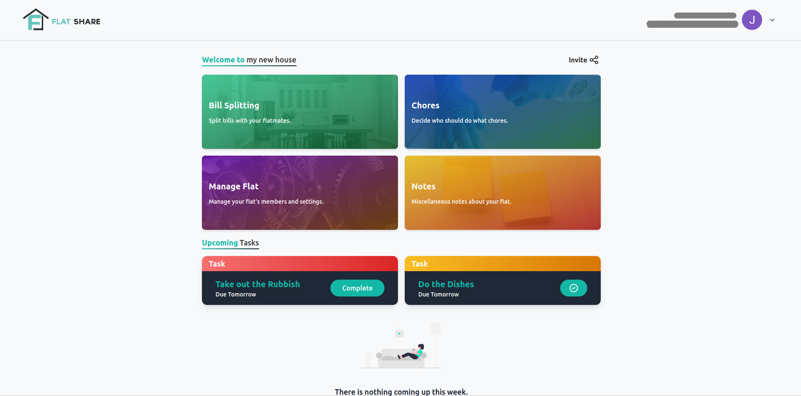

<h1 align="center">
  <br>
  
</h1>

<h4 align="center">Flat management made simple.</h4>

<p align="center">

  
  

</p>

<p align="center">
  <a href="#key-features">Features</a> •
  <a href="#installation">Installation</a> •
  <a href="#running-tests">Tests</a> •
  <a href="#contributing">Contributing</a> •
  <a href="#tech-stack">Tech</a> •
  <a href="#license">License</a>
</p>

## Screenshots



## Key Features

- Bill Splitting
- Chores Management
- Synchronised Notes

## Installation

To clone and run this application, you'll need [Git](https://git-scm.com), [Node.js 16.x](https://nodejs.org/en/download/), [Yarn](https://yarnpkg.com/getting-started/install) and [MongoDB](https://www.mongodb.com/try/download/community) installed on your computer. From your command line:

```bash
# Clone this repository
$ git clone https://github.com/701-T4/platform

# Go into the repository
$ cd platform

# Install dependencies
$ yarn install

# Run the app
$ yarn start
```

by default your application will be hosted at `http://localhost:3000`, while the api will be hosted at
`http://localhost:4200/api`. These can be changed in the config/environment values.

## Running Tests

To run tests, run the following command

```bash
  yarn test
```

## Contributing

Contributions are always welcome!

See `CONTRIBUTING.md` for ways to get started.

Please adhere to this project's `code of conduct`.

## Tech Stack

**Client:** React, TailwindCSS, NextUI

**Server:** Node, NestJS, mongoose

## License

[MIT](https://choosealicense.com/licenses/mit/)
